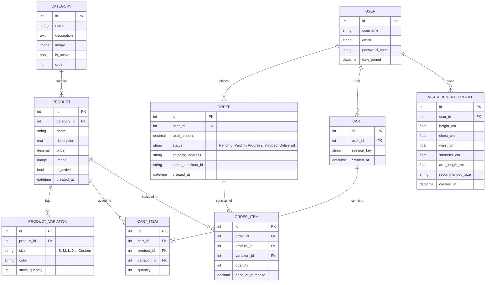

# MZ Tailors 🧵

A full-stack premium tailoring web application built with **Django 5**, **Tailwind CSS**, and **AI-powered features** including body measurement via MediaPipe and an intelligent chatbot powered by OpenAI & Gemini.

---

## 🚀 Features

- 🏠 **Dynamic Homepage** — Hero section, achievements stats, categories, services, testimonials & location map
- 🛍️ **Online Shop** — Product catalog with variations (size/color), cart & Stripe checkout
- 🤖 **AI Body Measurement** — Upload a photo and get size recommendations via MediaPipe
- 💬 **AI Chatbot** — OpenAI/Gemini powered chatbot widget for customer support
- 🎨 **3D Customizer** — Visual clothing customizer
- 📊 **Role-based Dashboards** — Admin, Employee & Customer dashboards
- 📝 **Articles & Blog** — Tailoring tips and fashion articles
- ⭐ **Testimonials & Feedback** — Customer reviews system
- 📍 **Contact & Location** — Google Maps integration
- 🔐 **Authentication** — Login, Register, Logout

---

## 🛠️ Tech Stack

| Layer | Technology |
|---|---|
| Backend | Django 5.2.8 |
| Frontend | Tailwind CSS, Font Awesome, Google Fonts |
| Database | SQLite (dev) |
| AI Measurement | MediaPipe, OpenCV |
| AI Chatbot | OpenAI GPT, Google Gemini |
| Payments | Stripe |
| Deployment | ngrok (dev tunneling) |
| Version Control | Git + GitHub |

---

## 📁 MVT Folder Structure

```text
MZtailors/
│
├── MZtailors/                        # Main Project Config
│   ├── settings.py                   # Global settings (DB, Apps, Media, etc.)
│   ├── urls.py                       # Root URL routing
│   ├── wsgi.py / asgi.py
│   └── __init__.py
│
├── tailors/                          # Main App
│   ├── models/                       # Models (MVT - Model Layer)
│   │   ├── base_models.py            # Logo, Category, Video, Article, Service,
│   │   │                             # Testimonial, Contact, Statistics
│   │   ├── shop_models.py            # Product, ProductVariation, Cart, CartItem
│   │   ├── orders_models.py          # Order, OrderItem
│   │   └── ai_models.py              # MeasurementProfile
│   │
│   ├── views/                        # Views (MVT - View Layer)
│   │   ├── public.py                 # Home, Services, Articles, Contact, Feedback
│   │   ├── shop.py                   # Shop, ProductDetail, Cart, Customizer
│   │   ├── checkout.py               # Checkout, PaymentSuccess (Stripe)
│   │   ├── auth.py                   # Login, Register, Logout
│   │   ├── dashboards.py             # Admin, Employee, Customer dashboards
│   │   ├── ai.py                     # AI Measurement view & processing
│   │   └── api.py                    # Chatbot API endpoint
│   │
│   ├── urls/
│   │   └── base.py                   # All URL patterns
│   │
│   ├── management/commands/
│   │   └── seed_project.py           # Management command to seed data
│   │
│   ├── migrations/
│   ├── admin.py
│   ├── forms.py                      # ContactForm, TestimonialForm
│   ├── ai_measure.py                 # MediaPipe body landmark logic
│   └── chatbot.py                    # OpenAI/Gemini chatbot logic
│
├── templates/                        # Templates (MVT - Template Layer)
│   ├── base.html                     # Base layout (Navbar, Footer, Animations)
│   └── tailors/
│       ├── home.html                 # Homepage
│       ├── shop.html                 # Product catalog
│       ├── product_detail.html       # Product detail + Add to Cart
│       ├── cart.html                 # Shopping cart
│       ├── checkout.html             # Stripe checkout
│       ├── services.html             # Services listing
│       ├── about.html                # About page
│       ├── contact.html              # Contact form
│       ├── feedback.html             # Customer feedback
│       ├── articles.html             # Blog/articles list
│       ├── article_detail.html       # Single article
│       ├── ai_measure.html           # AI measurement studio
│       ├── customizer.html           # 3D clothing customizer
│       ├── auth/
│       │   ├── login.html
│       │   └── register.html
│       └── dashboards/
│           ├── admin.html
│           ├── employee.html
│           ├── customer.html
│           └── management/           # CRUD for products, categories, services
│
├── static/
│   ├── css/style.css
│   ├── js/
│   └── images/
│
├── media/                            # User uploaded files
│   ├── products/
│   ├── categories/
│   ├── services/
│   ├── logos/
│   ├── articles/
│   └── hero_backgrounds/
│
├── example.env                       # Environment variable template
├── manage.py
└── db.sqlite3
```

---

## 📊 Entity-Relationship (ER) Diagram



### Key Relationships

- **User → Orders**: One user can place many orders
- **User → Cart**: One user has one active cart (or session-based for guests)
- **User → MeasurementProfile**: One user can have multiple AI measurement records
- **Category → Products**: One category contains many products
- **Product → ProductVariations**: One product has multiple size/color variations
- **Cart → CartItems**: Cart holds multiple items linked to products and variations
- **Order → OrderItems**: Order records each product, variation, quantity and price at time of purchase

---

## ⚙️ Setup & Installation

### 1. Clone the repository
```bash
git clone git@github.com:mominali9/mztailor.git
cd mztailor
```

### 2. Create virtual environment
```bash
python3 -m venv .venv
source .venv/bin/activate
```

### 3. Install dependencies
```bash
pip install -r requirements.txt
```

### 4. Configure environment variables
```bash
cp example.env .env
# Edit .env and fill in your API keys
```

```env
OPENAI_API_KEY=your_openai_api_key_here
GEMINI_API_KEY=your_gemini_api_key_here
HF_TOKEN=your_huggingface_token_here
```

### 5. Run migrations
```bash
python manage.py migrate
```

### 6. Create superuser
```bash
python manage.py createsuperuser
```

### 7. Seed sample data (optional)
```bash
python manage.py seed_project
```

### 8. Run the development server
```bash
python manage.py runserver
```

Visit: **http://127.0.0.1:8000**

---

## 🔗 URL Routes

| URL | View | Description |
|---|---|---|
| `/` | `public.home` | Homepage |
| `/shop/` | `shop.shop` | Product catalog |
| `/product/<id>/` | `shop.product_detail` | Product detail |
| `/cart/` | `shop.cart_view` | Shopping cart |
| `/checkout/` | `checkout.checkout_view` | Stripe checkout |
| `/services/` | `public.services` | Services listing |
| `/about/` | `public.about` | About page |
| `/contact/` | `public.contact` | Contact form |
| `/feedback/` | `public.feedback` | Customer feedback |
| `/articles/` | `public.articles_list` | Blog articles |
| `/ai-measure/` | `ai.ai_measure` | AI body measurement |
| `/customizer/` | `shop.customizer_view` | 3D customizer |
| `/login/` | `auth.login_view` | Login |
| `/register/` | `auth.register_view` | Register |
| `/dashboard/` | `dashboards.dashboard_redirect` | Role-based redirect |
| `/api/chatbot/` | `api.chatbot_api` | Chatbot API |
| `/api/process-measurement/` | `ai.process_measurement` | AI measurement API |

---

## 🌐 Admin Panel

Access Django admin at: **http://127.0.0.1:8000/admin**

Manage:
- Logo, Categories, Products, Services
- Orders, Testimonials, Contact messages
- Statistics (homepage counters)
- Articles & Videos

---

## 👨‍💻 Developer

**Momin Ali**
- Email: mominalikhoker589@gmail.com
- Company: **AQ Tech**

---

## 📄 License

This project is proprietary software developed for **MZ Tailors**, Bahawalpur, Pakistan.
